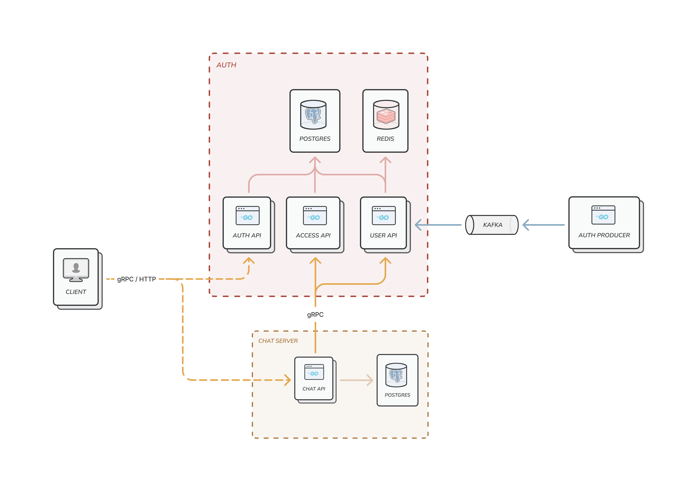

# cli-chat  [](https://goreportcard.com/report/github.com/Genvekt/cli-chat/services/auth)
---

Chat application based on Golang microservices. Project combines various modern technologies, applying clean architecture principles. 

### Technologies

---

- Language: Golang 1.22
- Protocols: gRPC with TLS, gRPC gateways, HTTP
- Database: PostgreSQL
- Event Bus: Kafka
- Metrics: Prometheus, Grafana, Jaeger
- Authentication: JWT

### System diagram

---


### Project structure

---
Project structured as monorepository of services, that share common libraries
```
├── libraries            # common libraries chared by services
│   │
│   ├── api             # gRPC contracts specification with protocol buffers
│   ├── cache_client    # wrapper for redis client
│   ├── closer          # applicalion gracefull shutdown utility
│   ├── db_client       # wrapper for postgres client
│   ├── kafka           # wrappers for kafka consumer and producer
│   └── logger          # common logger (zap)
│
└── services 
    │
    ├── auth            # Service that manages users, authenctication and authorisation
    ├── auth_postgres   # DB for auth service
    ├── auth_producer   # Service with kafka producer to create random users
    │
    ├── chat_server           # Service that manages chats and messages
    ├── chat_sercer_postgres  # DB for chat_server service
    │
    ├── kafka           # Kafka deployment files
    ├── metrics         # Prometheus and Grafana deployment files
    └── tracing         # Jaeger deployment files

